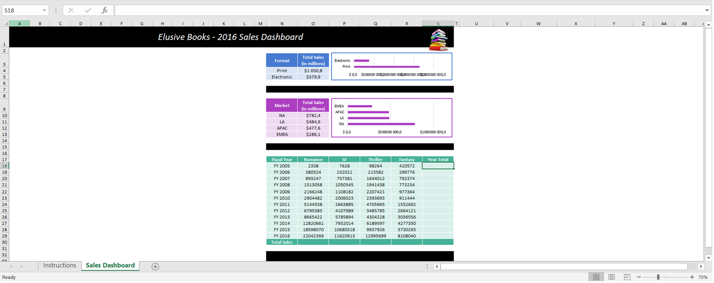
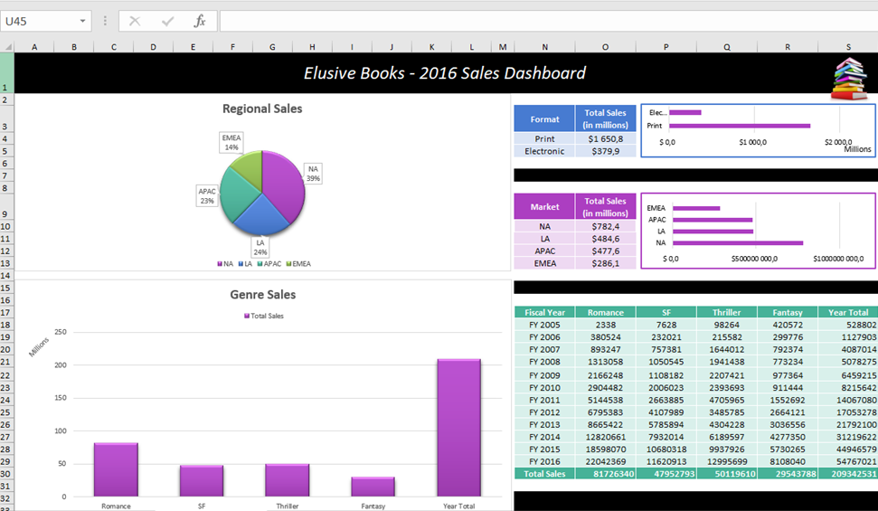

# excel-skills-for-business-essentials

Weekly Excel assessments and practical exercises completed during the Excel Skills for Business: Essentials course.

## W02 Assessment
Topics covered:
- basic formatting,
- working with rows and columns,
- autofill and fill handle,
- tables and worksheet organization.

## W04 Assessment
Practical Excel tasks using a business dataset, including:
- sorting and filtering data,
- conditional formatting,
- Find & Replace,
- calculating averages and order metrics,
- identifying records using filters and search tools,
- top/bottom percentage analysis.

## Screenshots

### W04 Assessment

## W06 - Sales Dashboard Challenge

Built an Excel sales dashboard for a fictional online bookstore using charts, dashboard layout techniques, and data visualization tools.

### Skills Used
- Pie Charts
- Column & Line Charts
- Dashboard Design
- Data Visualization
- Axis Formatting
- Chart Customization
- Data Labels & Legends

### Before

### Final Dashboard

## Next Step

This repository covers projects and assessments from the Excel Skills for Business: Essentials course.

The next repository will focus on more advanced Excel topics, including business reporting, data management, data integration, automation, consolidation techniques, dashboards, and advanced spreadsheet workflows.
